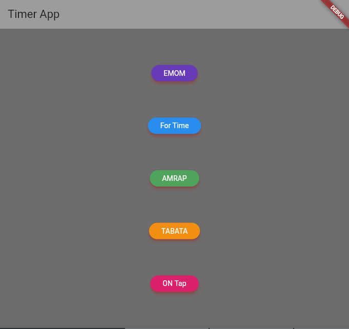

# Timer de Ejercicios en Flutter



## Descripción del Proyecto

Este proyecto personal en Flutter consiste en una aplicación de temporizador diseñada para facilitar el seguimiento del tiempo durante sesiones de ejercicio. Hasta ahora, la aplicación incluye dos tipos de temporizadores: EMOM (Every Minute on the Minute) y OnTap.

### Características Actuales

#### EMOM (Every Minute on the Minute)
- Temporizador simple que permite configurar la duración y el número de rondas.
- Incluye señales sonoras en los últimos 3 segundos y al llegar a cero.

#### OnTap
- Temporizador para medir la duración total del entrenamiento.
- Permite iniciar un temporizador de descanso controlado al pulsar el botón "Start".
- Proporciona sonidos de cuenta regresiva y finalización del tiempo.

### Funcionalidades Futuras
La aplicación se encuentra en constante desarrollo, y se planea agregar más funcionalidades, como:

- **Tabata:** Temporizador para entrenamientos estilo Tabata.
- **AMRAP (As Many Rounds As Possible):** Temporizador para realizar la mayor cantidad de rondas en un tiempo fijo.
- **Temporizador Normal:** Para entrenamientos personalizados con tiempos específicos.

## Capturas de Pantalla


## Instalación

1. Clone el repositorio a su máquina local.
   ```bash
   git clone https://github.com/tu-usuario/tu-proyecto.git
e.
